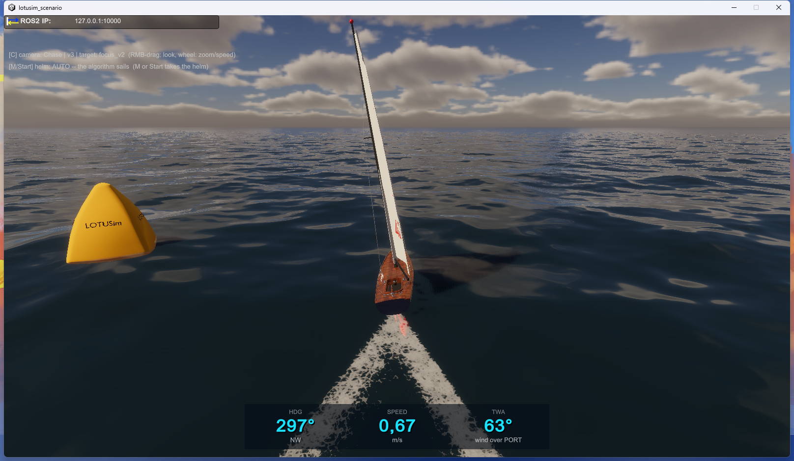

# Unity native water-foam spike — verification

**Date:** 2026-07-29  
**Decision:** production cutover completed

> Historical verification update — the production Windows project now uses
> Unity `2023.1.20f1` / HDRP `15.0.7`. The final wake evolved from the spike's
> static arms to four periodically driven dynamic `WaterFoamGenerator`s per
> boat, with bow and stern injection and a `BowWave` `WaterDeformer`;
> `WakeEmitter` is disabled. The final evidence is EditMode `41/41`, a
> successful Windows player build with 9 warnings, and accepted mono-boat
> visual validation. A separate player containing `Launcher` and
> `defenseScenario` also builds; multi-boat and `defenseScenario` visual
> non-regression are not qualified.

## Result

The isolated Unity 2023.1 spike produces a dense, speed-dependent V wake with
HDRP's native local foam. The foam is rendered on the displaced water surface,
does not become airborne with the hull, and fades after the vessel stops.



The Unity 2022 source project at
`C:\Users\cyril\lotusim-unity` was not modified by this spike; the later
production cutover is recorded above.

## Versions

- Unity `2023.1.20f1` (`35a524b12060`)
- HDRP, Core, URP, and Shader Graph `15.0.7`
- production branch: `feature/regatta-scenario`
- production worktree: `C:\Users\cyril\lotusim-unity`
- isolated project:
  `C:\Users\cyril\lotusim-unity-2023.1-spike`
- player:
  `C:\Users\cyril\lotusim-unity-2023.1-spike\Builds\Regatta\Regatta.exe`

## Migration correction

HDRP 15 inserted `InstancedQuads` into `WaterGeometryType`. The migrated scene
retained serialized value `2`, which changed the ocean from `Infinite` to
`InstancedQuads` and made it effectively disappear at the existing transform
scale. Setting the Ocean `WaterSurface.geometryType` to `3` restored the
infinite sea.

The active Regatta camera was also verified to receive:

- an HDRP asset with water and water foam enabled;
- the global `WaterRendering` volume override;
- the camera `FrameSettingsField.Water` flag.

## Wake configuration

Water surface:

- foam atlas: `1024`, area `32 m × 32 m`, offset `(0, 7.5)`;
- persistence multiplier: `0.45`;
- texture tiling: `2`;
- smoothness: `0.3`;
- simulation foam amount: `0.2`.

Focus V2 prefab:

- rejected `WakeEmitter` disabled;
- two serialized disk generators used as moving wake-crest brushes;
- one bow and one stern disk generator created at runtime;
- one runtime `BowWave` water deformer;
- half-angle: `19.5°`;
- wake brush: `0.12 m × 0.18 m`, maximum dimmer `0.75`;
- stern foam: `0.16 m × 0.34 m`, dimmer `0.22`;
- bow foam: `0.28 m × 0.5 m`, dimmer `0.25`;
- bow wave: `1 m × 2 m`, depth `0.12`, elevation `0.1`.

`NativeFoamWakeController` scales foam quadratically from zero below
`0.04 m/s` to full intensity at `0.8 m/s`. Successive crests use a dynamic
period of `0.35–0.8 s` and length of `0.25–1.3 m`. A pose step above `0.25 m`
is treated as a discontinuity and injects no foam. Intensity smoothing is
`0.15 s`.

## Verification evidence

Final EditMode evidence:

```text
testcasecount=41 result=Passed passed=41 failed=0
```

Final Windows player-build evidence:

```text
[BuildRegatta] Succeeded — 369 MB, 0 errors, 9 warnings
```

The enabled historical scenes also complete a separate Windows player build:

```text
Assets/Scenes/Launcher.unity
Assets/Scenes/Defense/defenseScenario.unity
Build Finished, Result: Success.
```

Live command, with exactly one simulator stack and one Unity player:

```bash
UNITY=1 ./scripts/run_regatta.sh 900 hold
```

Observed:

- the ocean remains visible and animated;
- two foam arms start at the stern and diverge symmetrically;
- rough waves deform the foam without under-wave cuts;
- no particle cards or airborne markers are present;
- the vessel remains stable with no multi-publisher teleportation;
- after stopping the stack, the HUD reaches `0.00 m/s` and the foam disappears
  naturally within a few seconds.

The temporary runtime diagnostic used to inspect HDRP's camera volume stack and
prefab axes was removed before the final tests and build.

## Remaining qualification

The production cutover is complete. Do not infer fleet readiness from this
mono-boat evidence: multi-boat wake rendering and visual non-regression of
`defenseScenario` remain to be qualified.
